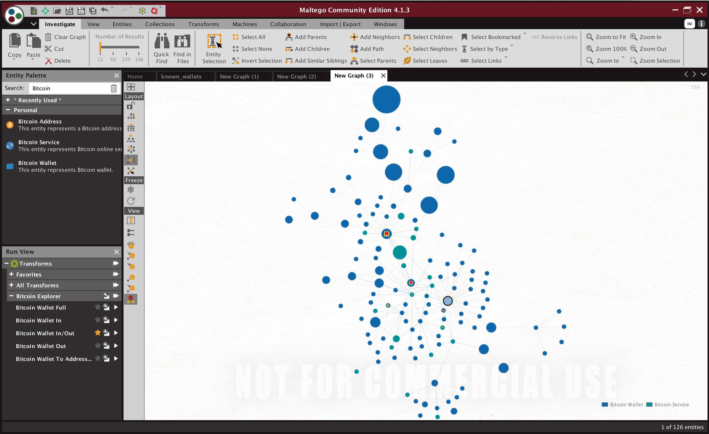
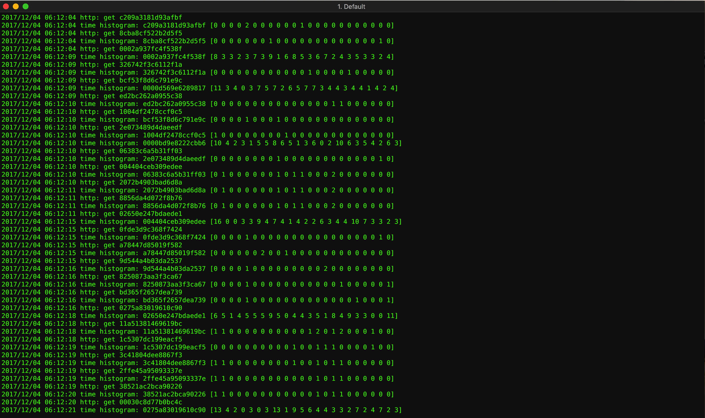
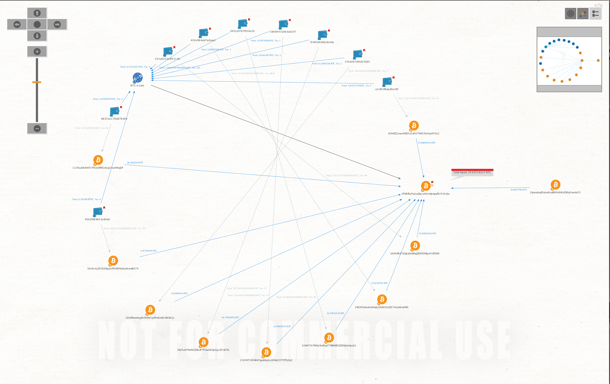

## Maltego BTC

Set of Maltego transforms written in Go for Bitcoin addresses/wallets investigation. Based on [walletexplorer.com](https://www.walletexplorer.com/) API.

### Installation

Requirements:

 - Maltego 4.0 or higher
 - Redis (used for cache)
 - Go 1.7+

Clone repository locally and run: ```make && make install``` (tested under macOS Sierra only for now).

### Config options

Edit config.json and re-run installation commands. List of config options:

 - ```logfile``` – path to logfile
 - ```redis_url``` – Redis connection string (host:port)
 - ```link_default``` – color of arrows from wallets and addresses
 - ```link_service``` – color of arrows from large services
 - ```wallet_max_size``` – max count of transactions to distinguish personal wallets and large services (default 2000)
 - ```cache_addresses``` – max number of addresses to cache
 - ```cache_wallets``` – max number of wallets to cache
 - ```icon_address``` – url to address entity icon
 - ```icon_wallet``` – url to wallet entity icon
 - ```icon_service``` – url to service entity icon
}
 
### Screenshots





Enjoy responsibly!
